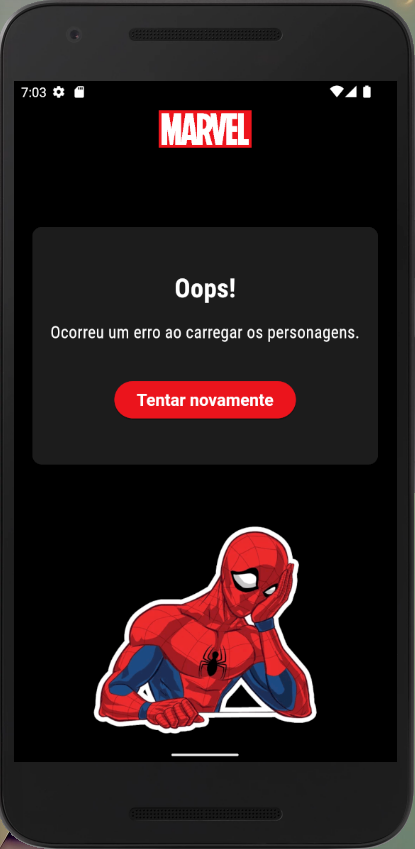

<h1 align="center">
  
Catálogo de Personagens Marvel

</h1>

Aplicativo desenvolvido em Flutter com o objetivo de aplicar conceitos intermediários do framework. 

Explore e descubra uma vasta coleção de personagens icônicos em ordem alfabética, tudo em um só lugar, desde os heróis mais famosos até os anti-heróis mais enigmáticos. 

<h1 align="center">
    
</h1>

## Funcionalidades

- **Lista alfabética de personagens:** Navegue facilmente por uma lista completa de personagens da Marvel em ordem alfabética. Encontre seus heróis favoritos e descubra novos personagens com apenas alguns toques.

- **Busca rápida:** Utilize a ferramenta de busca para encontrar rapidamente um personagem específico. Basta digitar o nome e deixar o aplicativo fazer o trabalho para você.

- **Detalhes do personagem:** Ao clicar em um personagem específico, você será levado para a tela de detalhes, onde encontrará informações importantes sobre ele. Se houver uma descrição disponível, ela será exibida para que você conheça a origem, poderes, habilidades e um pouco da história do personagem.

- **Lista de quadrinhos:** Descubra em quais quadrinhos o personagem aparece! Acesse uma lista completa das edições de quadrinhos em que o herói esteve presente.

- **Buscar mais:** Se houver mais de 100 registros de personagens ou quadrinhos, o aplicativo permite carregar mais resultados. Com um simples toque no botão "Buscar mais", você terá acesso a uma lista expandida de personagens ou quadrinhos, permitindo que você explore todo o acervo da Marvel.
  
- **Design Intuitivo:** O aplicativo possui um design intuitivo e amigável, garantindo uma experiência de usuário agradável e facilitando a navegação.

- **Tela de Erro:** Caso ocorra algum erro ao buscar a lista de personagens ou suas informações adicionais, o aplicativo exibirá uma tela de erro. Nessa tela, você terá a opção de tentar a busca novamente.

<h1 align="center">
    
    
</h1>

## Pré-requisitos
- Flutter SDK 3.10.5 ou superior
- Dart SDK 3.0.5 ou superior
## Estrutura do Projeto

A estrutura do projeto segue os padrões do Flutter, organizando os arquivos de forma clara e modular. Os principais diretórios são:

- **lib:** Contém os arquivos principais do aplicativo.
- **lib/entities:** Arquivos de classe.
- **lib/models:** Arquivos de serialização de JSON.
- **lib/network:** Estrutura base das requisições.
- **lib/pages:** Telas da aplicação.
- **lib/store:** Arquivos de gerenciamento de estado da aplicação.
- **lib/utils:** Arquivos utilitários.
- **lib/widgets:** Widgets reutilizáveis.
  
## Autora

O Catálogo de Personagens Marvel foi desenvolvido por Gabriely Machado, durante o módulo intermediário do programa Renew your Carrer de Flutter.
